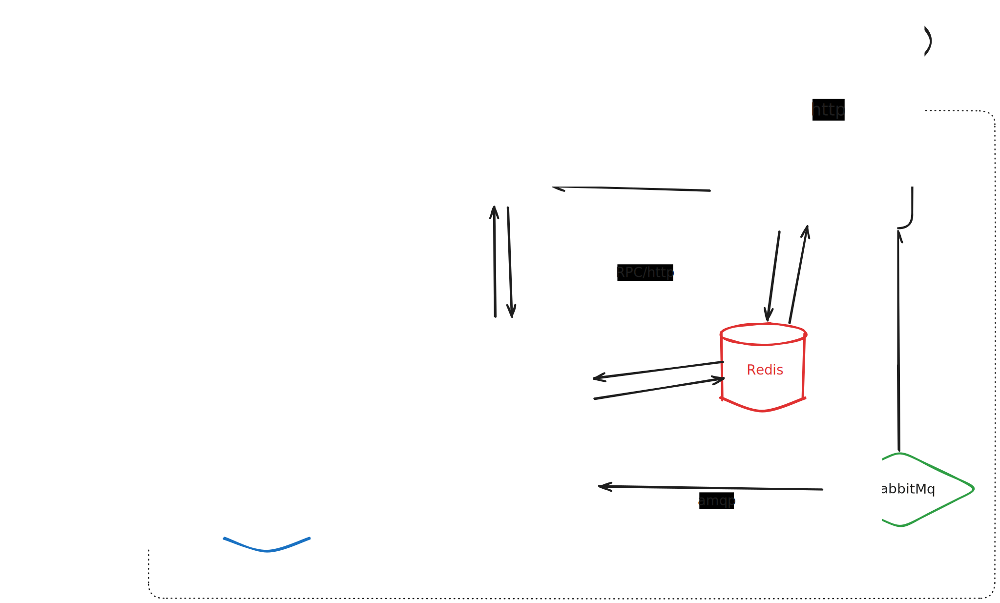

# ContextCanvas

Non-Linear AI for Complex Thought — Stop forcing branching thoughts into linear chat streams.

ContextCanvas is a spatial AI canvas that lets you organize conversations as interconnected nodes, attach files, and think in multiple directions at once.

## Architecture



## Tech Stack

| Layer | Stack |
|-------|-------|
| Front-end | React 19, React Flow, TailwindCSS 4, Redux Toolkit, React Query, Vite |
| Back-end | Go, Gin, GORM, JWT |
| AI Service | Python, FastAPI, Anthropic / OpenAI / Google / DeepSeek SDKs |
| Infrastructure | MySQL 8, Redis, RabbitMQ, MinIO, Nginx |
| Deployment | Docker Compose, GitHub Actions CI/CD, Let's Encrypt TLS |

## Features

- **Spatial Canvas** — Drag-and-drop nodes on an infinite canvas with visual edges representing context relationships
- **Multi-Model Chat** — Claude, GPT-4o, Gemini 2.0 Flash, DeepSeek R1 with streaming responses (SSE)
- **Branching Conversations** — Tree-structured messages, navigate and branch at any point
- **Context Graph** — Parent nodes automatically feed context into child conversations
- **File Resources** — Upload PDF, DOCX, XLSX, PPTX, images; attach as resource nodes to canvas
- **Tool Calling** — AI can search the web and read URLs mid-conversation
- **Full-Text Search** — Search across canvases, conversations, and message content
- **Auto Titles** — AI-generated conversation titles

## Project Structure

```
back-end/
  cmd/server/         Entry point
  internal/
    api/              HTTP route handlers
    service/          Business logic
    repo/             Data access layer
    model/            GORM models
    dto/              Request/response schemas
    middleware/       Auth, CORS, logging
    infra/            DB, cache, queue, storage clients
  config/             Configuration

front-end/
  src/
    view/             Page components
    ui/               Reusable UI components
    router/           Route definitions
    service/          API client
    query/            React Query hooks
    feature/          Feature-specific logic (canvas, chat, file)

ai-service/
  app/
    api/              FastAPI routes
    service/          LLM orchestration, tool execution
    model/            Pydantic schemas

deploy/
  docker-compose.yml  Full stack orchestration
  nginx/              Reverse proxy config
  init-letsencrypt.sh TLS certificate setup
```

## Getting Started

### Prerequisites

- Docker & Docker Compose
- Go 1.25+
- Node.js 20+
- Python 3.11+

### Development

```bash
# Start infrastructure services
cd deploy
docker compose up -d

# Back-end
cd back-end
go run cmd/server/main.go

# Front-end
cd front-end
npm install
npm run dev

# AI Service
cd ai-service
pip install -r requirements.txt
uvicorn app.main:app --port 8001
```

### Production Deployment

```bash
cd deploy
docker compose up -d --build
```

CI/CD is configured via GitHub Actions — pushes to `main` trigger automatic deployment.

## API Overview

| Group | Prefix | Description |
|-------|--------|-------------|
| Auth | `/api/auth` | Register, login, logout, password reset |
| User | `/api/user` | Profile and settings |
| Canvas | `/api/canvas` | CRUD, sync nodes/edges, search, versioning |
| Chat | `/api/chat` | Send messages, stream completions (SSE), branching |
| File | `/api/file` | Upload, list, delete, storage quota |

## License

All rights reserved.
